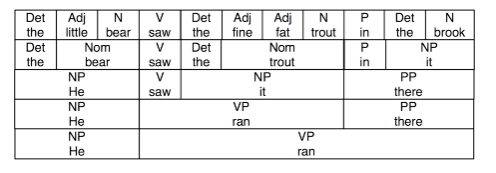

# Context-Free Grammars - Codealong

## Introduction

In this lab, we'll write our own **_Context-Free Grammar_** (CFG) to provide a parser with rules for how sentences can be parsed. We'll also explore how we can easily obtain **_Part-of-Speech (POS) Tags_** using NLTK!

## Objectives

You will be able to:

- Use NLTK to create context-free grammar and part-of-speech (POS) tags  

### Creating A Context-Free Grammar

The first thing we'll do in this lab is create our own CFG and use it to parse a sentence. The goal of this is to help us better understand the **_recursive_** nature of context-free grammars. By definition, these grammars have to be recursive, because valid sentences can contain other smaller, valid sentences. Consider the following example, pulled from the NLTK book's chapter on Analyzing Sentence Structure. We've highlighted the top-level verb phrase in each sentence. 

a.		Usain Bolt **broke the 100m record**

b.		The Jamaica Observer **reported that Usain Bolt broke the 100m record**

c.		Andre **said The Jamaica Observer reported that Usain Bolt broke the 100m record**

d.		I **think Andre said the Jamaica Observer reported that Usain Bolt broke the 100m record**

What do we notice?

In the examples above, each sentence is easily recognizable as being grammatically valid. And yet, we can see that sentence 'd' contains three other possible valid sentences. This is because of the recursive structure of grammar. Recall that a sentence (S) is made up of a Noun Phrase (NP) and a Verb Phrase (VP). This gets interesting when we realize that both NPs and VPs are allowed to be made up of other NPs and VPs! In each of the sentences above, we can see that the smaller sentences are just constituent pieces of the top-level Verb Phrase. For example, in sentence _b_, the top-level Noun Phrase is "The Jamaica Observer". The top-level Verb Phrase is 'reported that Usain Bolt broke the 100m record'. However, this Verb Phrase can be broken down into a verb 'reported', and a noun phrase 'that Usain Bolt broke the 100m record.' This noun phrase can itself be broken down into the smaller, valid parse tree from the first sentence, with 'Usain Bolt' as a noun phrase, and 'broke the 100m record' as a verb phrase. All this recursion can be a bit confusing! Luckily, computers are really, really good at it. 

To really drive this point home about sentences being made up of recursive units of words, take a look at the following diagram (also from the NLTK ch. 8 provided above):



This diagram shows the various valid combinations words from the sentences "He ran" and "The little bear saw the fine fat trout in the brook". As we can see from the diagram, as long as we're switching out grammatical units that are the same type (e.g. a noun phrase for a noun phrase), the result is a completely valid sentence -- both "the little bear saw the fine fat trout in the brook" and "he saw the fine fat trout in the brook" are grammatically correct. This means that we don't actually need to care what the actual words are -- just their grammatical part of speech! 

Now that we've seen some examples, let's get to creating our own CFG and using it to create a parse tree!

#### Generating a CFG 

NLTK makes it extremely easy to generate a CFG by providing a helper function. Here's the example we saw in the last lesson, which was also pulled from the NLTK book in chapter 8:


```python
import nltk
```


```python
groucho_grammar = nltk.CFG.fromstring("""
S -> NP VP
PP -> P NP
NP -> Det N | Det N PP | 'I'
VP -> V NP | VP PP
Det -> 'an' | 'my'
N -> 'elephant' | 'pajamas'
V -> 'shot'
P -> 'in'
""")
```

Once we run the cells above, we'll have created a CFG, which we can then feed into a parser object. For this lesson, we'll use NLTK's chart parser, which we can find in `nltk.ChartParser()`.

In the cell below, create a parser by passing in `groucho_grammar`.


```python
parser = nltk.ChartParser(groucho_grammar)
```

Now that we have a parser, we can use it to parse sentences by passing in a tokenized sentence to the parser's `.parse()` method. This will return 0 or more **_Parse Trees_** for that sentence. If the sentence cannot be parsed, it will return no trees. If there is more than one grammatically valid way (according to the rules defined in our CFG) to parse the sentence, then it will return them all. 

Run the cell below to complete the example from the NLTK book:


```python
sent = ['I', 'shot', 'an', 'elephant', 'in', 'my', 'pajamas']
for tree in parser.parse(sent):
    print(tree)
```

    (S
      (NP I)
      (VP
        (VP (V shot) (NP (Det an) (N elephant)))
        (PP (P in) (NP (Det my) (N pajamas)))))
    (S
      (NP I)
      (VP
        (V shot)
        (NP (Det an) (N elephant) (PP (P in) (NP (Det my) (N pajamas))))))


Great! Now that we have a working example, let's create our own, to parse the first sentence from the Usain Bolt example!

To keep things simple, we've already labeled the words as their given parts of speech inside the grammar below. This way, we only need to focus on what sorts of rules we give the CFG to define the valid structures for noun phrases, verb phrases, and prepositional phrases.

#### Parsing a Sentence

Run the cells below. This will:

1. Create a sample grammar. The grammar can be broken down into two sections: 
    1. Rules defining valid compositions for Sentences (S), Prepositional Phrases (PP), Noun Phrases (NP), and Verb Phrases (VP). These are incomplete, and we'll need to modify them to get the sentences to parse correctly  
    2. Mappings that define the POS tag for each word we'll be working with, as seen from the line `Det ->` and all the lines after it. These will be provided for you at each step, so that you only have to worry about the rules 
2. Step 2 defines the sentences we'll be working with as strings  
3. Step 3 creates a tokenized version of each sentence  
4. Step 4 creates a new parser with our `grammar` CFG 
5. Step 5 tries to parse the tokenized version of the sentence  

Run these cells now. 


```python
# Step 1
grammar = nltk.CFG.fromstring("""
S -> NP VP
PP -> P NP
NP -> Det N | Det N PP | 
VP -> V NP | VP PP
Det -> 'the'
Adj -> '100m'
N -> 'usain_bolt' | 'record' | 
V -> 'broke'
P -> 
""")
```


```python
# Step 2
from nltk import word_tokenize
sent = 'usain_bolt broke the 100m record'
```


```python
# Step 3
tokenized_sent = word_tokenize(sent)
```


```python
# Step 4
parser = nltk.ChartParser(grammar)
```


```python
# Step 5
for tree in parser.parse(tokenized_sent):
    print(tree)
```

The cell above didn't print anything, which means that our parser was unable to parse `tokenized_sent` correctly. Although it recognizes all the words (it would throw an error if it came across an unrecognized word), it doesn't contain the rules necessary to correctly parse this sentence. 

Let's work through it together, so that we can get a feel for how this is done. 

For this part, you may want to get a pencil and paper -- it's much easier when you diagram the sentences out by hand!

In line 1 of our grammar, we've defined that our sentence must consist of a valid noun phrase, followed by a valid verb phrase. It doesn't matter how large or small these are, or how many layers of recursive depth they have -- as long as they fit the rules for a noun phrase/verb phrase, it's okay. 

This means that our rules likely don't reflect the structure seen in this sentence, so we'll need to modify the rules by adding more cases that cover this. 

To do this, we can just add a `|` symbol, and then add the new rules. But what rules should we add?

To figure this out, we need to actually look at the sentence itself. Let's look at the sentence, but add in the POS tags for each word, as defined by their mappings in the CFG.

`(usain_bolt, N), (broke, V), (the, Det), (100m, Adj), (record, N)`

This means that the structure of our sentence can be mapped as:

                                      S
                                    /   \
                                  NP     VP
                                 /      /   \
                                N      V     NP
                               /      /      /  \    
                     'usain_bolt' 'broke'   Det  NP  
                                           /    /   \
                                        'the'  Adj   N
                                               /      \
                                             '100m'  'record'
                                             
So how do we go from this tree, to modifying the grammar rules? We just check to make sure that each sub-tree that stems from an NP or a VP can be constructed given the rules listed in the grammar for each. 

Let's start from the beginning. We see that our noun phrase consists only of a noun (N). This means that we've found the first problem -- we haven't defined a rule in the NP section of our grammar that says that's allowed! 

This means that we need to change our grammar's NP line from `NP -> NP -> Det N | Det N PP ` to `NP -> Det N | Det N PP | N `, thereby providing a rule that says that single nouns (N) are allowed to act as a valid noun phrase. 

Moving onto our verb phrase, we see that our verb phrase consists of a verb and a noun phrase. If we look at the first rule for verb phrases, `VP -> V NP`, we can see that this is already explicitly covered. Since the verb portion of phrase is fine, this means the error lies in the NP portion of our VP. We can see that the structure of this NP is `Det Adj N`, which our NP rules do not currently allow for. 

We can fix this by modifying our NP phrase in a few ways. We can modify it by simply adding `Det Adj N` as a case for our NP rules, and not use any recursion. This is a valid way to fix it, but with large grammars, the number of rules we write will go through the roof, since we're treating each possible combination as a special case. 

We can also use recursion to fix this. Let's define what we need to add to get this working:

* Noun Phrases (NP) need to be able to consist of `Det` followed by a Noun Phrase `NP`. 
* Noun Phrases need to be able to consist of `Adj` followed by an `N`.

This is where we can get a bit clever. To solve the first point, we need to add a rule that says that a Noun Phrase (NP) can be a Det followed by a Noun Phrase, NP -- `Det NP` will work to solve this.  Note that if we add this line in, the first rule that explicitly spells out `Det N` becomes redundant. Since our recursive structure will catch these sorts of cases, we no longer need to explicitly spell it out. This means we can remove it to increase our performance a little bit. 

For the second point, we can also use recursion. Since we have already defined that single nouns (N) are a valid form of a noun phrase, we can chain this together with adjectives by adding the rule `Adj NP`. 

This means that we need to add these rules to the `NP ->` line in our grammar, with each one separated by a `|` (with a space on each side). 

This means our grammar should now look like: 

```python
grammar = nltk.CFG.fromstring("""
S -> NP VP
PP -> P NP
NP -> Det N PP | N | Det NP | Adj NP
VP -> V NP | VP PP
Det -> 'the'
Adj -> '100m'
N -> 'usain_bolt' | 'record' | 
V -> 'broke'
P -> 
""")

```

Let's try reloading our grammar, and reparsing our sentence. 

In the cell below:

* Modify and recreate our CFG using our updated rules  
* Recreate our parser with the updated rules  
* Try to parse `tokenized_sent` and see if we get any output  


```python
grammar = nltk.CFG.fromstring("""
S -> NP VP
PP -> P NP
NP -> Det N PP | N | Det NP | Adj NP
VP -> V NP | VP PP
Det -> 'the'
Adj -> '100m'
N -> 'usain_bolt' | 'record' | 
V -> 'broke'
P -> 
""")
```


```python
parser = nltk.ChartParser(grammar)
```


```python
for tree in parser.parse(tokenized_sent):
    print(tree)
```

    (S
      (NP (N usain_bolt))
      (VP (V broke) (NP (Det the) (NP (Adj 100m) (NP (N record))))))
    (S
      (NP (N usain_bolt))
      (VP
        (V broke)
        (NP (Det the) (N ) (PP (P ) (NP (Adj 100m) (NP (N record)))))))
    (S
      (NP (N usain_bolt))
      (VP
        (VP (V broke) (NP (N )))
        (PP (P ) (NP (Det the) (NP (Adj 100m) (NP (N record)))))))
    (S
      (NP (N usain_bolt))
      (VP
        (VP (V broke) (NP (N )))
        (PP
          (P )
          (NP (Det the) (N ) (PP (P ) (NP (Adj 100m) (NP (N record))))))))
    (S
      (NP (N usain_bolt))
      (VP
        (VP (VP (V broke) (NP (N ))) (PP (P ) (NP (N ))))
        (PP (P ) (NP (Det the) (NP (Adj 100m) (NP (N record)))))))
    (S
      (NP (N usain_bolt))
      (VP
        (VP (VP (V broke) (NP (N ))) (PP (P ) (NP (N ))))
        (PP
          (P )
          (NP (Det the) (N ) (PP (P ) (NP (Adj 100m) (NP (N record))))))))
    (S
      (NP (N usain_bolt))
      (VP
        (VP (V broke) (NP (Det the) (NP (N ))))
        (PP (P ) (NP (Adj 100m) (NP (N record))))))
    (S
      (NP (N usain_bolt))
      (VP
        (VP (V broke) (NP (Det the) (N ) (PP (P ) (NP (N )))))
        (PP (P ) (NP (Adj 100m) (NP (N record))))))
    (S
      (NP (N usain_bolt))
      (VP
        (VP (VP (V broke) (NP (N ))) (PP (P ) (NP (Det the) (NP (N )))))
        (PP (P ) (NP (Adj 100m) (NP (N record))))))
    (S
      (NP (N usain_bolt))
      (VP
        (VP
          (VP (V broke) (NP (N )))
          (PP (P ) (NP (Det the) (N ) (PP (P ) (NP (N ))))))
        (PP (P ) (NP (Adj 100m) (NP (N record))))))
    (S
      (NP (N usain_bolt))
      (VP
        (VP
          (VP (VP (V broke) (NP (N ))) (PP (P ) (NP (N ))))
          (PP (P ) (NP (Det the) (NP (N )))))
        (PP (P ) (NP (Adj 100m) (NP (N record))))))
    (S
      (NP (N usain_bolt))
      (VP
        (VP
          (VP (VP (V broke) (NP (N ))) (PP (P ) (NP (N ))))
          (PP (P ) (NP (Det the) (N ) (PP (P ) (NP (N ))))))
        (PP (P ) (NP (Adj 100m) (NP (N record))))))
    (S
      (NP (N usain_bolt))
      (VP
        (VP (VP (V broke) (NP (Det the) (NP (N )))) (PP (P ) (NP (N ))))
        (PP (P ) (NP (Adj 100m) (NP (N record))))))
    (S
      (NP (N usain_bolt))
      (VP
        (VP
          (VP (V broke) (NP (Det the) (N ) (PP (P ) (NP (N )))))
          (PP (P ) (NP (N ))))
        (PP (P ) (NP (Adj 100m) (NP (N record))))))
    (S
      (NP (N usain_bolt))
      (VP
        (VP (V broke) (NP (Det the) (NP (Adj 100m) (NP (N )))))
        (PP (P ) (NP (N record)))))
    (S
      (NP (N usain_bolt))
      (VP
        (VP
          (V broke)
          (NP (Det the) (N ) (PP (P ) (NP (Adj 100m) (NP (N ))))))
        (PP (P ) (NP (N record)))))
    (S
      (NP (N usain_bolt))
      (VP
        (VP
          (VP (V broke) (NP (N )))
          (PP (P ) (NP (Det the) (NP (Adj 100m) (NP (N ))))))
        (PP (P ) (NP (N record)))))
    (S
      (NP (N usain_bolt))
      (VP
        (VP
          (VP (V broke) (NP (N )))
          (PP
            (P )
            (NP (Det the) (N ) (PP (P ) (NP (Adj 100m) (NP (N )))))))
        (PP (P ) (NP (N record)))))
    (S
      (NP (N usain_bolt))
      (VP
        (VP
          (VP (VP (V broke) (NP (N ))) (PP (P ) (NP (N ))))
          (PP (P ) (NP (Det the) (NP (Adj 100m) (NP (N ))))))
        (PP (P ) (NP (N record)))))
    (S
      (NP (N usain_bolt))
      (VP
        (VP
          (VP (VP (V broke) (NP (N ))) (PP (P ) (NP (N ))))
          (PP
            (P )
            (NP (Det the) (N ) (PP (P ) (NP (Adj 100m) (NP (N )))))))
        (PP (P ) (NP (N record)))))
    (S
      (NP (N usain_bolt))
      (VP
        (VP
          (VP (V broke) (NP (Det the) (NP (N ))))
          (PP (P ) (NP (Adj 100m) (NP (N )))))
        (PP (P ) (NP (N record)))))
    (S
      (NP (N usain_bolt))
      (VP
        (VP
          (VP (V broke) (NP (Det the) (N ) (PP (P ) (NP (N )))))
          (PP (P ) (NP (Adj 100m) (NP (N )))))
        (PP (P ) (NP (N record)))))
    (S
      (NP (N usain_bolt))
      (VP
        (VP
          (VP
            (VP (V broke) (NP (N )))
            (PP (P ) (NP (Det the) (NP (N )))))
          (PP (P ) (NP (Adj 100m) (NP (N )))))
        (PP (P ) (NP (N record)))))
    (S
      (NP (N usain_bolt))
      (VP
        (VP
          (VP
            (VP (V broke) (NP (N )))
            (PP (P ) (NP (Det the) (N ) (PP (P ) (NP (N ))))))
          (PP (P ) (NP (Adj 100m) (NP (N )))))
        (PP (P ) (NP (N record)))))
    (S
      (NP (N usain_bolt))
      (VP
        (VP
          (VP
            (VP (VP (V broke) (NP (N ))) (PP (P ) (NP (N ))))
            (PP (P ) (NP (Det the) (NP (N )))))
          (PP (P ) (NP (Adj 100m) (NP (N )))))
        (PP (P ) (NP (N record)))))
    (S
      (NP (N usain_bolt))
      (VP
        (VP
          (VP
            (VP (VP (V broke) (NP (N ))) (PP (P ) (NP (N ))))
            (PP (P ) (NP (Det the) (N ) (PP (P ) (NP (N ))))))
          (PP (P ) (NP (Adj 100m) (NP (N )))))
        (PP (P ) (NP (N record)))))
    (S
      (NP (N usain_bolt))
      (VP
        (VP
          (VP
            (VP (V broke) (NP (Det the) (NP (N ))))
            (PP (P ) (NP (N ))))
          (PP (P ) (NP (Adj 100m) (NP (N )))))
        (PP (P ) (NP (N record)))))
    (S
      (NP (N usain_bolt))
      (VP
        (VP
          (VP
            (VP (V broke) (NP (Det the) (N ) (PP (P ) (NP (N )))))
            (PP (P ) (NP (N ))))
          (PP (P ) (NP (Adj 100m) (NP (N )))))
        (PP (P ) (NP (N record)))))
    (S
      (NP (N usain_bolt))
      (VP
        (VP
          (VP (V broke) (NP (Det the) (NP (Adj 100m) (NP (N )))))
          (PP (P ) (NP (N ))))
        (PP (P ) (NP (N record)))))
    (S
      (NP (N usain_bolt))
      (VP
        (VP
          (VP
            (V broke)
            (NP (Det the) (N ) (PP (P ) (NP (Adj 100m) (NP (N ))))))
          (PP (P ) (NP (N ))))
        (PP (P ) (NP (N record)))))
    (S
      (NP (N usain_bolt))
      (VP
        (VP (V broke) (NP (Det the) (NP (Adj 100m) (NP (N record)))))
        (PP (P ) (NP (N )))))
    (S
      (NP (N usain_bolt))
      (VP
        (VP
          (V broke)
          (NP (Det the) (N ) (PP (P ) (NP (Adj 100m) (NP (N record))))))
        (PP (P ) (NP (N )))))


It worked! But why are there so many trees? Because as our rules stand, there are multiple valid interpretations of the sentence.  This is because we have some empty things like `PP -> P NP` that don't currently have rules, so they're triggering as false positives. 

### Generating POS Tags with NLTK

Now that we have a feel for how POS tags work and how they can be used with CFGs, let's quickly examine how we can generate POS tags automatically using NLTK!

#### The Penn Tree Bank

So far, we've been manually labeling our words to construct our CFGs. However, this strategy obviously doesn't scale well to the real world -- it would take way too long to label every possible word with a part of speech, and generate every rule possible for a CFG. Luckily, the linguists and programmers have provided a quick and easy way to have this done for us, thanks to the **_Penn Tree Bank_**! The [Penn Tree Bank](https://catalog.ldc.upenn.edu/docs/LDC95T7/cl93.html) is "a large annotated corpus of English", according to the researchers at Penn that created it. This means that it already has a ton of well-labeled examples for POS tagging. For us, this means that we can easily use NLTK to generate POS tags for our corpora, without having to worry about hand labeling or generating parse trees. 

#### Generating and Using POS Tags

POS tags are often used as a feature in text datasets. For tasks such as language generation, they are absolutely indispensable, as they allow us to generate sentences from words that are grammatically correct. POS tags can also be useful as feature for things such as text classification. 

Generating POS tags is very simple with NLTK -- all we need to do is pass in a tokenized version of our corpus and NLTK will return a list of tuples containing the token and it's part of speech.

Note that the abbreviations NLTK uses for their POS tags come from the Penn Tree Bank, and won't be immediately recognizable to you. To understand what these tags stand for, take a look at this [reference list].(https://www.ling.upenn.edu/courses/Fall_2003/ling001/penn_treebank_pos.html)

Let's end this lab by quickly generating some POS tags!

In the cells below, pass in `tokenized_sent` to `nltk.pos_tag()`.


```python
nltk.pos_tag(tokenized_sent)
```


    [('usain_bolt', 'JJ'),
     ('broke', 'VBD'),
     ('the', 'DT'),
     ('100m', 'CD'),
     ('record', 'NN')]


That's all it takes to generate POS tags using NLTK. Great job!


## Summary

In this lab, we wrote our own context-free grammar to create parse trees of sentences. We also learned how to quickly generate POS tags for text using NLTK and the Penn Tree Bank!
