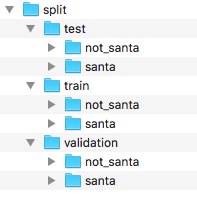
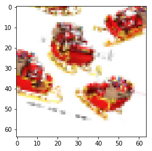
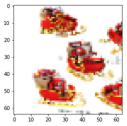
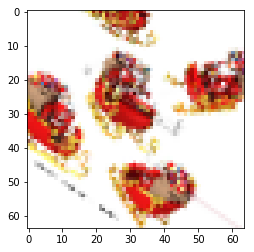

# Convolutional Neural Networks - Codealong

## Introduction

In this code-along, we will reinvestigate our previous Santa image classification example. To do this, we will review loading a dataset from a nested directory structure and building a baseline model. From there, we'll demonstrate building a CNN and demonstrate its improved performance on image recognition tasks. You are recommended to run the cells in order to further explore variables and investigate the code snippets themselves. However, please note that some cells (particularly training cells later on) may take some time to run. [On a Macbook pro the entire notebook took ~15 minutes to run.]

## Objectives  

You will be able to:
* Load data from a hierarchical directory structure
* Build a CNN for image recognition tasks

## Properly store your images

When you're analyzing your image data, file management is important. We will be using the santa images again, but this time, they are just stored in two folders: `santa` and `not_santa`, under. We want to work with a `train`, `validation` and `test` data set now, as we know by now that this is the best way to go. 

Let's import libraries `os` and `shutil`, as we'll need them to create the new folders and move the new files in there.


```python
import os, shutil
```

Create three objects representing the existing directories 'data/santa/' as `data_santa_dir` and 'data/not_santa/' as `data_not_santa_dir`. We will create a new directory 'split/' as `new_dir`, where we will split the data set in three groups (or three subdirectories) 'train', 'test' and 'validation', each containing `santa` and `not_santa` subfolders. The final desired structure is represented below:




```python
data_santa_dir = 'data/santa/'
data_not_santa_dir = 'data/not_santa/'
new_dir = 'split/'
```

You can use `os.listdir()` to create an object that stores all the relevant image names. 


```python
imgs_santa = [file for file in os.listdir(data_santa_dir) if file.endswith('.jpg')]
```


```python
imgs_santa[0:10]
```


    ['00000428.jpg',
     '00000400.jpg',
     '00000366.jpg',
     '00000372.jpg',
     '00000414.jpg',
     '00000399.jpg',
     '00000158.jpg',
     '00000164.jpg',
     '00000170.jpg',
     '00000038.jpg']


Let's see how many images there are in the 'santa' directory.


```python
print('There are',len(imgs_santa), 'santa images')
```

    There are 461 santa images


Now, repeat this for the 'not_santa' directory


```python
imgs_not_santa = [file for file in os.listdir(data_not_santa_dir) if file.endswith('.jpg')]
```


```python
print('There are', len(imgs_not_santa), 'images without santa')
```

    There are 461 images without santa


Create all the folders and subfolder in order to get the structure represented above. You can use `os.path.join` to create strings that will be used later on to generate new directories.


```python
os.mkdir(new_dir)
```


```python
train_folder = os.path.join(new_dir, 'train')
train_santa = os.path.join(train_folder, 'santa')
train_not_santa = os.path.join(train_folder, 'not_santa')

test_folder = os.path.join(new_dir, 'test')
test_santa = os.path.join(test_folder, 'santa')
test_not_santa = os.path.join(test_folder, 'not_santa')

val_folder = os.path.join(new_dir, 'validation')
val_santa = os.path.join(val_folder, 'santa')
val_not_santa = os.path.join(val_folder, 'not_santa')
```


```python
train_santa
```


    'split/train/santa'


Now use all the path strings you created to make new directories. You can use `os.mkdir()` to do this. Go have a look at your directory and see if this worked!


```python
os.mkdir(test_folder)
os.mkdir(test_santa)
os.mkdir(test_not_santa)

os.mkdir(train_folder)
os.mkdir(train_santa)
os.mkdir(train_not_santa)

os.mkdir(val_folder)
os.mkdir(val_santa)
os.mkdir(val_not_santa)
```

Copy the Santa images in the three santa subfolders. Let's put the first 271 images in the training set, the next 100 images in the validation set and the final 90 images in the test set.


```python
# train santa
imgs = imgs_santa[:271]
for img in imgs:
    origin = os.path.join(data_santa_dir, img)
    destination = os.path.join(train_santa, img)
    shutil.copyfile(origin, destination)
```


```python
# validation santa
imgs = imgs_santa[271:371]
for img in imgs:
    origin = os.path.join(data_santa_dir, img)
    destination = os.path.join(val_santa, img)
    shutil.copyfile(origin, destination)
```


```python
# test santa
imgs = imgs_santa[371:]
for img in imgs:
    origin = os.path.join(data_santa_dir, img)
    destination = os.path.join(test_santa, img)
    shutil.copyfile(origin, destination)
```

Now, repeat all this for the 'not_santa' images!


```python
# train not_santa
imgs = imgs_not_santa[:271]
for img in imgs:
    origin = os.path.join(data_not_santa_dir, img)
    destination = os.path.join(train_not_santa, img)
    shutil.copyfile(origin, destination)
# validation not_santa
imgs = imgs_not_santa[271:371]
for img in imgs:
    origin = os.path.join(data_not_santa_dir, img)
    destination = os.path.join(val_not_santa, img)
    shutil.copyfile(origin, destination)
# test not_santa
imgs = imgs_not_santa[371:]
for img in imgs:
    origin = os.path.join(data_not_santa_dir, img)
    destination = os.path.join(test_not_santa, img)
    shutil.copyfile(origin, destination)
```

Let's print out how many images we have in each directory so we know for sure our numbers are right!


```python
print('There are', len(os.listdir(train_santa)), 'santa images in the training set')
```

    There are 271 santa images in the training set


```python
print('There are', len(os.listdir(val_santa)), 'santa images in the validation set')
```

    There are 100 santa images in the validation set


```python
print('There are', len(os.listdir(test_santa)), 'santa images in the test set')
```

    There are 90 santa images in the test set


```python
print('There are', len(os.listdir(train_not_santa)), 'images without santa in the train set')
```

    There are 271 images without santa in the train set


```python
print('There are', len(os.listdir(val_not_santa)), 'images without santa in the validation set')
```

    There are 100 images without santa in the validation set


```python
print('There are', len(os.listdir(test_not_santa)), 'images without santa in the test set')
```

    There are 90 images without santa in the test set


## Use a densely connected network as a baseline

Now that we've sorted our data, we can easily use Keras' module with image-processing tools. Let's import the necessary libraries below. 


```python
import time
import matplotlib.pyplot as plt
import scipy
import numpy as np
from PIL import Image
from scipy import ndimage
from keras.preprocessing.image import ImageDataGenerator, array_to_img, img_to_array, load_img

np.random.seed(123)
```

    /Users/matthew.mitchell/anaconda3/lib/python3.6/site-packages/h5py/__init__.py:36: FutureWarning: Conversion of the second argument of issubdtype from `float` to `np.floating` is deprecated. In future, it will be treated as `np.float64 == np.dtype(float).type`.
      from ._conv import register_converters as _register_converters
    Using TensorFlow backend.


```python
# get all the data in the directory split/test (180 images), and reshape them
test_generator = ImageDataGenerator(rescale=1./255).flow_from_directory(
        test_folder, 
        target_size=(64, 64), batch_size = 180) 

# get all the data in the directory split/validation (200 images), and reshape them
val_generator = ImageDataGenerator(rescale=1./255).flow_from_directory(
        val_folder, 
        target_size=(64, 64), batch_size = 200)

# get all the data in the directory split/train (542 images), and reshape them
train_generator = ImageDataGenerator(rescale=1./255).flow_from_directory(
        train_folder, 
        target_size=(64, 64), batch_size=542)
```

    Found 180 images belonging to 2 classes.
    Found 200 images belonging to 2 classes.
    Found 542 images belonging to 2 classes.


```python
# create the data sets
train_images, train_labels = next(train_generator)
test_images, test_labels = next(test_generator)
val_images, val_labels = next(val_generator)
```


```python
# Explore your dataset again
m_train = train_images.shape[0]
num_px = train_images.shape[1]
m_test = test_images.shape[0]
m_val = val_images.shape[0]

print ("Number of training samples: " + str(m_train))
print ("Number of testing samples: " + str(m_test))
print ("Number of validation samples: " + str(m_val))
print ("train_images shape: " + str(train_images.shape))
print ("train_labels shape: " + str(train_labels.shape))
print ("test_images shape: " + str(test_images.shape))
print ("test_labels shape: " + str(test_labels.shape))
print ("val_images shape: " + str(val_images.shape))
print ("val_labels shape: " + str(val_labels.shape))
```

    Number of training samples: 542
    Number of testing samples: 180
    Number of validation samples: 200
    train_images shape: (542, 64, 64, 3)
    train_labels shape: (542, 2)
    test_images shape: (180, 64, 64, 3)
    test_labels shape: (180, 2)
    val_images shape: (200, 64, 64, 3)
    val_labels shape: (200, 2)


```python
train_img = train_images.reshape(train_images.shape[0], -1)
test_img = test_images.reshape(test_images.shape[0], -1)
val_img = val_images.reshape(val_images.shape[0], -1)

print(train_img.shape)
print(test_img.shape)
print(val_img.shape)
```

    (542, 12288)
    (180, 12288)
    (200, 12288)


```python
train_y = np.reshape(train_labels[:,0], (542,1))
test_y = np.reshape(test_labels[:,0], (180,1))
val_y = np.reshape(val_labels[:,0], (200,1))
```


```python
from keras import models
from keras import layers
np.random.seed(123)
model = models.Sequential()
model.add(layers.Dense(20, activation='relu', input_shape=(12288,))) #2 hidden layers
model.add(layers.Dense(7, activation='relu'))
model.add(layers.Dense(5, activation='relu'))
model.add(layers.Dense(1, activation='sigmoid'))
```


```python
model.compile(optimizer='sgd',
              loss='binary_crossentropy',
              metrics=['accuracy'])

histoire = model.fit(train_img,
                    train_y,
                    epochs=50,
                    batch_size=32,
                    validation_data=(val_img, val_y))
```

    Train on 542 samples, validate on 200 samples
    Epoch 1/50
    542/542 [==============================] - 1s 1ms/step - loss: 0.6993 - acc: 0.4760 - val_loss: 0.6654 - val_acc: 0.4900
    Epoch 2/50
    542/542 [==============================] - 0s 163us/step - loss: 0.6990 - acc: 0.5277 - val_loss: 0.6900 - val_acc: 0.5200
    Epoch 3/50
    542/542 [==============================] - 0s 179us/step - loss: 0.6881 - acc: 0.4926 - val_loss: 0.6725 - val_acc: 0.5250
    Epoch 4/50
    542/542 [==============================] - 0s 185us/step - loss: 0.6716 - acc: 0.5572 - val_loss: 0.6536 - val_acc: 0.6050
    Epoch 5/50
    542/542 [==============================] - 0s 163us/step - loss: 0.6627 - acc: 0.5923 - val_loss: 0.6565 - val_acc: 0.5350
    Epoch 6/50
    542/542 [==============================] - 0s 166us/step - loss: 0.6783 - acc: 0.5258 - val_loss: 0.6705 - val_acc: 0.5000
    Epoch 7/50
    542/542 [==============================] - 0s 154us/step - loss: 0.6772 - acc: 0.5000 - val_loss: 0.6682 - val_acc: 0.5000
    Epoch 8/50
    542/542 [==============================] - 0s 223us/step - loss: 0.6746 - acc: 0.5000 - val_loss: 0.6647 - val_acc: 0.5000
    Epoch 9/50
    542/542 [==============================] - 0s 267us/step - loss: 0.6708 - acc: 0.5000 - val_loss: 0.6625 - val_acc: 0.5050
    Epoch 10/50
    542/542 [==============================] - 0s 273us/step - loss: 0.6673 - acc: 0.4963 - val_loss: 0.6584 - val_acc: 0.5000
    Epoch 11/50
    542/542 [==============================] - 0s 183us/step - loss: 0.6633 - acc: 0.5092 - val_loss: 0.6520 - val_acc: 0.5150
    Epoch 12/50
    542/542 [==============================] - 0s 177us/step - loss: 0.6592 - acc: 0.5148 - val_loss: 0.6480 - val_acc: 0.5000
    Epoch 13/50
    542/542 [==============================] - 0s 168us/step - loss: 0.6511 - acc: 0.5572 - val_loss: 0.6413 - val_acc: 0.5300
    Epoch 14/50
    542/542 [==============================] - 0s 226us/step - loss: 0.6374 - acc: 0.6347 - val_loss: 0.6063 - val_acc: 0.7850
    Epoch 15/50
    542/542 [==============================] - 0s 205us/step - loss: 0.6011 - acc: 0.7362 - val_loss: 0.6780 - val_acc: 0.6200
    Epoch 16/50
    542/542 [==============================] - 0s 179us/step - loss: 0.5898 - acc: 0.7159 - val_loss: 0.5728 - val_acc: 0.6850
    Epoch 17/50
    542/542 [==============================] - 0s 195us/step - loss: 0.5545 - acc: 0.7491 - val_loss: 0.5532 - val_acc: 0.7700
    Epoch 18/50
    542/542 [==============================] - 0s 195us/step - loss: 0.5747 - acc: 0.6790 - val_loss: 0.6016 - val_acc: 0.6950
    Epoch 19/50
    542/542 [==============================] - 0s 151us/step - loss: 0.5156 - acc: 0.7638 - val_loss: 0.5868 - val_acc: 0.5750
    Epoch 20/50
    542/542 [==============================] - 0s 149us/step - loss: 0.5615 - acc: 0.7103 - val_loss: 0.5084 - val_acc: 0.7900
    Epoch 21/50
    542/542 [==============================] - 0s 169us/step - loss: 0.5225 - acc: 0.7232 - val_loss: 0.4835 - val_acc: 0.8200
    Epoch 22/50
    542/542 [==============================] - 0s 153us/step - loss: 0.5049 - acc: 0.7454 - val_loss: 0.4741 - val_acc: 0.8250
    Epoch 23/50
    542/542 [==============================] - 0s 157us/step - loss: 0.4838 - acc: 0.7934 - val_loss: 0.4603 - val_acc: 0.8400
    Epoch 24/50
    542/542 [==============================] - 0s 174us/step - loss: 0.4918 - acc: 0.7620 - val_loss: 0.4687 - val_acc: 0.7950
    Epoch 25/50
    542/542 [==============================] - 0s 298us/step - loss: 0.4357 - acc: 0.8487 - val_loss: 0.4428 - val_acc: 0.8450
    Epoch 26/50
    542/542 [==============================] - 0s 224us/step - loss: 0.4695 - acc: 0.7970 - val_loss: 0.6217 - val_acc: 0.5750
    Epoch 27/50
    542/542 [==============================] - 0s 217us/step - loss: 0.5084 - acc: 0.7306 - val_loss: 0.6245 - val_acc: 0.7050
    Epoch 28/50
    542/542 [==============================] - 0s 216us/step - loss: 0.4856 - acc: 0.7786 - val_loss: 0.6269 - val_acc: 0.5800
    Epoch 29/50
    542/542 [==============================] - 0s 211us/step - loss: 0.4031 - acc: 0.8321 - val_loss: 0.7131 - val_acc: 0.6900
    Epoch 30/50
    542/542 [==============================] - 0s 199us/step - loss: 0.3801 - acc: 0.8395 - val_loss: 0.4263 - val_acc: 0.8200
    Epoch 31/50
    542/542 [==============================] - 0s 193us/step - loss: 0.4418 - acc: 0.7989 - val_loss: 0.4377 - val_acc: 0.8200
    Epoch 32/50
    542/542 [==============================] - 0s 163us/step - loss: 0.4142 - acc: 0.8118 - val_loss: 0.9273 - val_acc: 0.5050
    Epoch 33/50
    542/542 [==============================] - 0s 165us/step - loss: 0.4603 - acc: 0.7768 - val_loss: 0.4542 - val_acc: 0.7900
    Epoch 34/50
    542/542 [==============================] - 0s 270us/step - loss: 0.3468 - acc: 0.8579 - val_loss: 0.4765 - val_acc: 0.7500
    Epoch 35/50
    542/542 [==============================] - 0s 252us/step - loss: 0.4044 - acc: 0.8081 - val_loss: 0.4996 - val_acc: 0.7650
    Epoch 36/50
    542/542 [==============================] - 0s 239us/step - loss: 0.3146 - acc: 0.8764 - val_loss: 0.7289 - val_acc: 0.7050
    Epoch 37/50
    542/542 [==============================] - 0s 200us/step - loss: 0.4086 - acc: 0.8081 - val_loss: 0.4396 - val_acc: 0.8100
    Epoch 38/50
    542/542 [==============================] - 0s 217us/step - loss: 0.3892 - acc: 0.8303 - val_loss: 0.3889 - val_acc: 0.8250
    Epoch 39/50
    542/542 [==============================] - 0s 200us/step - loss: 0.3566 - acc: 0.8432 - val_loss: 0.4734 - val_acc: 0.7500
    Epoch 40/50
    542/542 [==============================] - 0s 190us/step - loss: 0.2809 - acc: 0.8930 - val_loss: 0.8760 - val_acc: 0.7050
    Epoch 41/50
    542/542 [==============================] - 0s 184us/step - loss: 0.3796 - acc: 0.8561 - val_loss: 0.3889 - val_acc: 0.8150
    Epoch 42/50
    542/542 [==============================] - 0s 272us/step - loss: 0.2679 - acc: 0.8985 - val_loss: 0.4336 - val_acc: 0.8150
    Epoch 43/50
    542/542 [==============================] - 0s 234us/step - loss: 0.3444 - acc: 0.8616 - val_loss: 0.4948 - val_acc: 0.7850
    Epoch 44/50
    542/542 [==============================] - 0s 210us/step - loss: 0.3688 - acc: 0.8413 - val_loss: 0.3845 - val_acc: 0.8300
    Epoch 45/50
    542/542 [==============================] - 0s 198us/step - loss: 0.2762 - acc: 0.9022 - val_loss: 0.4126 - val_acc: 0.8350
    Epoch 46/50
    542/542 [==============================] - 0s 300us/step - loss: 0.4167 - acc: 0.8155 - val_loss: 0.4485 - val_acc: 0.8150
    Epoch 47/50
    542/542 [==============================] - 0s 207us/step - loss: 0.3059 - acc: 0.8801 - val_loss: 0.4013 - val_acc: 0.8350
    Epoch 48/50
    542/542 [==============================] - 0s 197us/step - loss: 0.3685 - acc: 0.8487 - val_loss: 0.3730 - val_acc: 0.8350
    Epoch 49/50
    542/542 [==============================] - 0s 186us/step - loss: 0.3195 - acc: 0.8745 - val_loss: 0.3921 - val_acc: 0.8400
    Epoch 50/50
    542/542 [==============================] - 0s 186us/step - loss: 0.2061 - acc: 0.9244 - val_loss: 0.3917 - val_acc: 0.8350


```python
results_train = model.evaluate(train_img, train_y)
```

    542/542 [==============================] - 0s 92us/step


```python
results_test = model.evaluate(test_img, test_y)
```

    180/180 [==============================] - 0s 124us/step


```python
results_train
```


    [0.18455020236573097, 0.9501845018450185]


```python
results_test
```


    [0.4134899788432651, 0.8166666679912143]


Remember that, in our previous lab on building deeper neural networks from scratch, we obtained a training accuracy of 95%, and a test set accuracy of 74.23%.

This result is similar to what we got building our manual "deeper" dense model. The results are not entirely different. This is not a surprise!
- Before, we only had a training and a validation set (which was at the same time the test set). Now we have split up the data 3-ways.
- We didn't use minibatches before, yet we used mini-batches of 32 units here.


## Convnet


```python
model = models.Sequential()
model.add(layers.Conv2D(32, (3, 3), activation='relu',
                        input_shape=(64 ,64,  3)))
model.add(layers.MaxPooling2D((2, 2)))

model.add(layers.Conv2D(32, (4, 4), activation='relu'))
model.add(layers.MaxPooling2D((2, 2)))

model.add(layers.Conv2D(64, (3, 3), activation='relu'))
model.add(layers.MaxPooling2D((2, 2)))

model.add(layers.Flatten())
model.add(layers.Dense(64, activation='relu'))
model.add(layers.Dense(1, activation='sigmoid'))

model.compile(loss='binary_crossentropy',
              optimizer="sgd",
              metrics=['acc'])
```


```python
history = model.fit(train_images,
                    train_y,
                    epochs=30,
                    batch_size=32,
                    validation_data=(val_images, val_y))
```

    Train on 542 samples, validate on 200 samples
    Epoch 1/30
    542/542 [==============================] - 5s 9ms/step - loss: 0.6837 - acc: 0.5240 - val_loss: 0.6723 - val_acc: 0.5000
    Epoch 2/30
    542/542 [==============================] - 4s 8ms/step - loss: 0.6739 - acc: 0.5000 - val_loss: 0.6650 - val_acc: 0.5000
    Epoch 3/30
    542/542 [==============================] - 4s 7ms/step - loss: 0.6669 - acc: 0.5000 - val_loss: 0.6574 - val_acc: 0.5000
    Epoch 4/30
    542/542 [==============================] - 4s 7ms/step - loss: 0.6603 - acc: 0.5074 - val_loss: 0.6492 - val_acc: 0.5300
    Epoch 5/30
    542/542 [==============================] - 4s 7ms/step - loss: 0.6494 - acc: 0.5517 - val_loss: 0.6384 - val_acc: 0.6050
    Epoch 6/30
    542/542 [==============================] - 4s 7ms/step - loss: 0.6381 - acc: 0.6125 - val_loss: 0.6238 - val_acc: 0.6450
    Epoch 7/30
    542/542 [==============================] - 5s 9ms/step - loss: 0.6234 - acc: 0.6642 - val_loss: 0.6049 - val_acc: 0.6600
    Epoch 8/30
    542/542 [==============================] - 3s 5ms/step - loss: 0.6053 - acc: 0.7030 - val_loss: 0.5866 - val_acc: 0.8100
    Epoch 9/30
    542/542 [==============================] - 3s 5ms/step - loss: 0.5852 - acc: 0.7712 - val_loss: 0.5567 - val_acc: 0.7000
    Epoch 10/30
    542/542 [==============================] - 3s 5ms/step - loss: 0.5708 - acc: 0.7620 - val_loss: 0.5480 - val_acc: 0.6400
    Epoch 11/30
    542/542 [==============================] - 3s 6ms/step - loss: 0.5404 - acc: 0.7915 - val_loss: 0.4930 - val_acc: 0.9050
    Epoch 12/30
    542/542 [==============================] - 3s 5ms/step - loss: 0.5165 - acc: 0.7860 - val_loss: 0.5049 - val_acc: 0.8300
    Epoch 13/30
    542/542 [==============================] - 3s 5ms/step - loss: 0.4873 - acc: 0.8007 - val_loss: 0.4296 - val_acc: 0.8950
    Epoch 14/30
    542/542 [==============================] - 3s 5ms/step - loss: 0.5321 - acc: 0.7380 - val_loss: 0.4056 - val_acc: 0.9100
    Epoch 15/30
    542/542 [==============================] - 3s 5ms/step - loss: 0.4941 - acc: 0.7712 - val_loss: 0.3898 - val_acc: 0.9150
    Epoch 16/30
    542/542 [==============================] - 3s 5ms/step - loss: 0.4778 - acc: 0.8007 - val_loss: 0.3938 - val_acc: 0.9100
    Epoch 17/30
    542/542 [==============================] - 3s 5ms/step - loss: 0.4218 - acc: 0.8432 - val_loss: 0.4365 - val_acc: 0.8000
    Epoch 18/30
    542/542 [==============================] - 3s 5ms/step - loss: 0.4276 - acc: 0.8284 - val_loss: 0.7790 - val_acc: 0.5700
    Epoch 19/30
    542/542 [==============================] - 3s 5ms/step - loss: 0.4141 - acc: 0.8469 - val_loss: 0.6650 - val_acc: 0.6200
    Epoch 20/30
    542/542 [==============================] - 3s 5ms/step - loss: 0.4352 - acc: 0.8155 - val_loss: 0.4016 - val_acc: 0.8000
    Epoch 21/30
    542/542 [==============================] - 3s 6ms/step - loss: 0.3494 - acc: 0.8856 - val_loss: 0.2754 - val_acc: 0.9250
    Epoch 22/30
    542/542 [==============================] - 3s 5ms/step - loss: 0.3930 - acc: 0.8284 - val_loss: 0.2862 - val_acc: 0.9200
    Epoch 23/30
    542/542 [==============================] - 3s 5ms/step - loss: 0.2942 - acc: 0.9041 - val_loss: 0.2790 - val_acc: 0.9300
    Epoch 24/30
    542/542 [==============================] - 3s 5ms/step - loss: 0.3122 - acc: 0.8838 - val_loss: 0.2805 - val_acc: 0.9000
    Epoch 25/30
    542/542 [==============================] - 3s 5ms/step - loss: 0.3318 - acc: 0.8690 - val_loss: 0.2706 - val_acc: 0.9200
    Epoch 26/30
    542/542 [==============================] - 3s 6ms/step - loss: 0.3035 - acc: 0.8985 - val_loss: 0.2691 - val_acc: 0.9150
    Epoch 27/30
    542/542 [==============================] - 3s 5ms/step - loss: 0.3003 - acc: 0.8782 - val_loss: 0.2244 - val_acc: 0.9350
    Epoch 28/30
    542/542 [==============================] - 3s 5ms/step - loss: 0.2478 - acc: 0.9096 - val_loss: 0.2237 - val_acc: 0.9350
    Epoch 29/30
    542/542 [==============================] - 3s 5ms/step - loss: 0.2855 - acc: 0.8856 - val_loss: 0.2815 - val_acc: 0.9050
    Epoch 30/30
    542/542 [==============================] - 3s 5ms/step - loss: 0.2500 - acc: 0.9077 - val_loss: 0.2446 - val_acc: 0.9300


```python
results_train = model.evaluate(train_images, train_y)
```

    542/542 [==============================] - 1s 2ms/step


```python
results_test = model.evaluate(test_images, test_y)
```

    180/180 [==============================] - 0s 2ms/step


```python
results_train
```


    [0.24712846997259288, 0.9243542437623787]


```python
results_test
```


    [0.31495937440130445, 0.9055555529064603]


## Data Augmentation

ImageDataGenerator becomes really useful when we *actually* want to generate more data. We'll show you how this works.


```python
train_datagen= ImageDataGenerator(rescale=1./255, 
     rotation_range=40,
     width_shift_range=0.2,
     height_shift_range=0.2,
     shear_range=0.3,
     zoom_range=0.1,
     horizontal_flip = False)
```


```python
names = [os.path.join(train_santa, name) for name in os.listdir(train_santa)]
img_path = names[91]
img = load_img(img_path, target_size=(64, 64))

reshape_img = img_to_array(img) 
reshape_img = reshape_img.reshape((1,) + reshape_img.shape) 
i=0
for batch in train_datagen.flow(reshape_img, batch_size=1):
    plt.figure(i)
    imgplot = plt.imshow(array_to_img(batch[0]))
    i += 1
    if i % 3 == 0:
        break
plt.show()
```











```python
# get all the data in the directory split/test (180 images), and reshape them
test_generator = ImageDataGenerator(rescale=1./255).flow_from_directory(
        test_folder, 
        target_size=(64, 64), 
        batch_size = 180,
        class_mode='binary') 

# get all the data in the directory split/validation (200 images), and reshape them
val_generator = ImageDataGenerator(rescale=1./255).flow_from_directory(
        val_folder, 
        target_size=(64, 64),
        batch_size = 32,
        class_mode='binary')

# get all the data in the directory split/train (542 images), and reshape them
train_generator = train_datagen.flow_from_directory(
        train_folder, 
        target_size=(64, 64), 
        batch_size = 32, 
        class_mode='binary')
```

    Found 180 images belonging to 2 classes.
    Found 200 images belonging to 2 classes.
    Found 542 images belonging to 2 classes.


```python
model = models.Sequential()
model.add(layers.Conv2D(32, (3, 3), activation='relu',
                        input_shape=(64 ,64,  3)))
model.add(layers.MaxPooling2D((2, 2)))

model.add(layers.Conv2D(32, (4, 4), activation='relu'))
model.add(layers.MaxPooling2D((2, 2)))

model.add(layers.Conv2D(64, (3, 3), activation='relu'))
model.add(layers.MaxPooling2D((2, 2)))

model.add(layers.Flatten())
model.add(layers.Dense(64, activation='relu'))
model.add(layers.Dense(1, activation='sigmoid'))

model.compile(loss='binary_crossentropy',
              optimizer= 'sgd',
              metrics=['acc'])
```


```python
history_2 = model.fit_generator(
      train_generator,
      steps_per_epoch=25,
      epochs=30,
      validation_data=val_generator,
      validation_steps=25)
```

    Epoch 1/30
    25/25 [==============================] - 24s 959ms/step - loss: 0.6825 - acc: 0.5088 - val_loss: 0.6784 - val_acc: 0.4931
    Epoch 2/30
    25/25 [==============================] - 18s 731ms/step - loss: 0.6809 - acc: 0.4889 - val_loss: 0.6705 - val_acc: 0.5057
    Epoch 3/30
    25/25 [==============================] - 19s 759ms/step - loss: 0.6700 - acc: 0.5099 - val_loss: 0.6649 - val_acc: 0.4986
    Epoch 4/30
    25/25 [==============================] - 19s 756ms/step - loss: 0.6716 - acc: 0.4925 - val_loss: 0.6545 - val_acc: 0.5142
    Epoch 5/30
    25/25 [==============================] - 18s 720ms/step - loss: 0.6618 - acc: 0.4953 - val_loss: 0.6480 - val_acc: 0.5412
    Epoch 6/30
    25/25 [==============================] - 17s 692ms/step - loss: 0.6488 - acc: 0.5585 - val_loss: 0.6350 - val_acc: 0.5426
    Epoch 7/30
    25/25 [==============================] - 17s 698ms/step - loss: 0.6406 - acc: 0.5986 - val_loss: 0.6131 - val_acc: 0.6179
    Epoch 8/30
    25/25 [==============================] - 18s 703ms/step - loss: 0.6182 - acc: 0.6848 - val_loss: 0.5917 - val_acc: 0.5701
    Epoch 9/30
    25/25 [==============================] - 19s 747ms/step - loss: 0.5995 - acc: 0.7053 - val_loss: 0.5610 - val_acc: 0.7159
    Epoch 10/30
    25/25 [==============================] - 19s 778ms/step - loss: 0.5746 - acc: 0.7722 - val_loss: 0.5229 - val_acc: 0.8736
    Epoch 11/30
    25/25 [==============================] - 21s 820ms/step - loss: 0.5355 - acc: 0.8202 - val_loss: 0.4920 - val_acc: 0.7500
    Epoch 12/30
    25/25 [==============================] - 18s 716ms/step - loss: 0.5157 - acc: 0.7957 - val_loss: 0.4750 - val_acc: 0.8558
    Epoch 13/30
    25/25 [==============================] - 19s 753ms/step - loss: 0.5224 - acc: 0.7517 - val_loss: 0.4509 - val_acc: 0.8679
    Epoch 14/30
    25/25 [==============================] - 17s 695ms/step - loss: 0.4365 - acc: 0.8322 - val_loss: 0.4074 - val_acc: 0.8608
    Epoch 15/30
    25/25 [==============================] - 19s 751ms/step - loss: 0.4558 - acc: 0.7927 - val_loss: 0.3604 - val_acc: 0.8626
    Epoch 16/30
    25/25 [==============================] - 15s 619ms/step - loss: 0.3974 - acc: 0.8244 - val_loss: 0.6614 - val_acc: 0.6222
    Epoch 17/30
    25/25 [==============================] - 18s 703ms/step - loss: 0.3881 - acc: 0.8430 - val_loss: 0.4041 - val_acc: 0.7926
    Epoch 18/30
    25/25 [==============================] - 18s 707ms/step - loss: 0.3873 - acc: 0.8208 - val_loss: 0.2955 - val_acc: 0.8991
    Epoch 19/30
    25/25 [==============================] - 20s 793ms/step - loss: 0.3690 - acc: 0.8472 - val_loss: 0.5001 - val_acc: 0.7418
    Epoch 20/30
    25/25 [==============================] - 19s 767ms/step - loss: 0.3411 - acc: 0.8567 - val_loss: 0.3544 - val_acc: 0.8693
    Epoch 21/30
    25/25 [==============================] - 17s 682ms/step - loss: 0.3096 - acc: 0.8796 - val_loss: 0.2478 - val_acc: 0.9190
    Epoch 22/30
    25/25 [==============================] - 18s 724ms/step - loss: 0.2971 - acc: 0.8921 - val_loss: 0.2591 - val_acc: 0.9217
    Epoch 23/30
    25/25 [==============================] - 17s 700ms/step - loss: 0.2797 - acc: 0.8945 - val_loss: 0.2508 - val_acc: 0.8963
    Epoch 24/30
    25/25 [==============================] - 17s 694ms/step - loss: 0.3001 - acc: 0.8614 - val_loss: 0.3669 - val_acc: 0.8585
    Epoch 25/30
    25/25 [==============================] - 19s 751ms/step - loss: 0.2836 - acc: 0.8869 - val_loss: 0.2718 - val_acc: 0.9233
    Epoch 26/30
    25/25 [==============================] - 19s 745ms/step - loss: 0.2654 - acc: 0.9030 - val_loss: 0.2096 - val_acc: 0.9272
    Epoch 27/30
    25/25 [==============================] - 16s 645ms/step - loss: 0.2532 - acc: 0.8948 - val_loss: 0.2557 - val_acc: 0.9176
    Epoch 28/30
    25/25 [==============================] - 17s 690ms/step - loss: 0.2838 - acc: 0.8935 - val_loss: 0.2240 - val_acc: 0.9261
    Epoch 29/30
    25/25 [==============================] - 18s 728ms/step - loss: 0.2906 - acc: 0.8950 - val_loss: 0.2873 - val_acc: 0.8984
    Epoch 30/30
    25/25 [==============================] - 24s 970ms/step - loss: 0.2447 - acc: 0.9083 - val_loss: 0.2566 - val_acc: 0.9048


```python
test_x, test_y = next(test_generator)
```


```python
results_test = model.evaluate(test_x, test_y)
```

    180/180 [==============================] - 0s 1ms/step


```python
results_test
```


    [0.2512160725063748, 0.9277777751286824]


## Summary  

In this code along lab, we looked again at some of the preprocessing techniques needed in order to organize our data prior to building a model using Keras. Afterwards, we investigated new code in order to build a CNN for image recognition.
